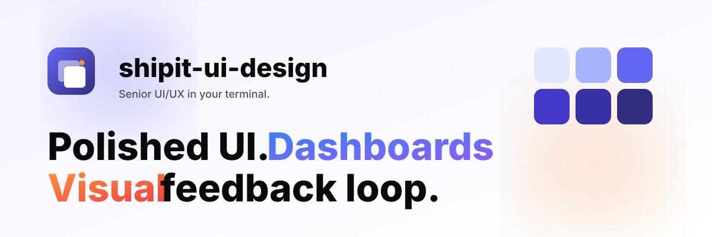

<div align="center">



<br><br>


# shipit-ui-design

**Senior UI/UX in your terminal.**

A [Claude Code](https://claude.com/claude-code) plugin that turns Claude Code into a senior UI/UX designer. Bootstraps design systems, generates polished components and dashboards (charts + KPIs), iterates visually via a screenshot-based critique loop. Plus palettes, motion, SVG, 3D — and a 7-rule constitution every artifact follows.

[](https://shipit-ui-design.vercel.app)
[](#-install--full-guide-for-new-users)
[](./LICENSE)


**Live demo →** [shipit-ui-design.vercel.app](https://shipit-ui-design.vercel.app) · [view 7 demo routes](https://shipit-ui-design.vercel.app/examples)

</div>

---

## 🎯 What it is

`shipit-ui-design` is a Claude Code plugin. After install, when you work on a UI project, Claude Code follows the plugin's design rules — tokenized values, full state coverage, accessibility, motion, dark mode by default, dashboard and chart literacy, and a senior eye for hierarchy and rhythm.

It does not generate slide decks, prototypes, or standalone artifacts. It works **inside** your project — adapting to your stack (Next, Vite, Remix, Astro, Nuxt, SvelteKit, React Native).

Sister tool: **[ShipIt Palette](https://github.com/shipiit/ShipIt_Palette)** — pick a color, ship the palette. The two are designed to work together: ShipIt Palette generates the colors, `shipit-ui-design` ships them as a design system inside your project.

---

## ✨ Highlights

- **8 slash commands** — `/design init`, `/palette`, `/component`, `/refine`, `/audit`, `/motion`, `/illustrate`, `/scene`
- **8 auto-activating skills** — UI principles, motion, design-system keeper, SVG, React Three Fiber, dashboards, data viz, color engineering
- **Visual critique loop** — Playwright screenshots your rendered pages, scores them against a 100-point rubric, applies fixes, re-screenshots, iterates
- **Dashboard literacy** — sidebar/topbar shells, KPI tiles, data tables, chart cards, filter bars, command palette, notification center — all blueprinted
- **Color engineering** — OKLCH ramps, WCAG + APCA contrast, colorblind-safe palettes, image extraction, perceptual mixing, gradient interpolation
- **6 curated palettes** — warm-editorial, neon-brutalism, cool-corporate, soft-pastel, deep-monochrome, vibrant-tech
- **Encoded design rules** — tinted neutrals, 60–30–10, mobile iOS/Android grid, sidebar spacing cheat sheet
- **The constitution** — 7 hard rules every artifact obeys (300-line cap, no hardcoded values, full state coverage, motion/a11y/dark-mode parity, stack-respect)
- **Stack-agnostic** — adapts to React, Vue, Svelte, Solid; Tailwind, CSS Modules, styled-components, vanilla CSS

---

## 🚀 Install — full guide for new users

Six steps, ~3 minutes total. Every step shows what to type and what you'll see.

### Step 1 — Install Claude Code

Skip if already installed.

| OS | Command |
|---|---|
| macOS | `brew install claude-code` |
| Windows | [Claude Code installer](https://claude.com/claude-code) |
| Linux | `npm install -g @anthropic-ai/claude-code` |
| Any (npm) | `npm install -g @anthropic-ai/claude-code` |

Verify:

```bash
claude --version
```

### Step 2 — Authenticate

```bash
claude
```

The first run opens a browser to sign in to your Anthropic account.

### Step 3 — Update if needed

`/plugin` requires a recent Claude Code:

```bash
brew upgrade claude-code            # macOS
npm install -g @anthropic-ai/claude-code@latest    # npm
```

### Step 4 — Open Claude Code in any project

```bash
cd your-project
claude
```

### Step 5 — Add the marketplace

Inside Claude Code:

```
/plugin marketplace add shipiit/shipit-ui-design
```

Confirms the marketplace `shipit` is registered with one available plugin. No plugins installed yet.

### Step 6 — Install the plugin

```
/plugin install shipit-ui-design@shipit
```

Installs to **user scope** (every project on your machine). For a different scope, type `/plugin` → **Discover** → press **Enter** on `shipit-ui-design` and choose:

| Scope | Who sees it |
|---|---|
| **User** (default) | Just you, every project |
| **Project** | Everyone on this repo (committed to `.claude/settings.json`) |
| **Local** | Just you, only this repo |

### Step 7 — Activate

```
/reload-plugins
```

Skills and commands light up immediately. Restarting Claude Code works too.

### Step 8 — Verify

```
/plugin
```

**Installed** tab should list `shipit-ui-design@shipit`. **Errors** tab should be empty. If not, see [🔧 Troubleshooting](#-troubleshooting).

### Step 9 (optional) — Install the visual-loop browser

For `/refine` (Playwright screenshots):

```bash
npx playwright install chromium
```

Skip if you don't plan to use `/refine`. Other commands work without it.

### Step 10 (recommended) — Make the rules apply by default

Skills already auto-activate when you edit `.tsx`, `.jsx`, `.vue`, `.svelte`, `tokens.css`, or `tailwind.config.*`. To make Claude Code apply the constitution **on every UI task without ever asking**, drop a `CLAUDE.md` at one of these locations and Claude reads it on every session:

| Scope | File | Effect |
|---|---|---|
| **Per-project** | `<your-project>/CLAUDE.md` | Default for this repo (commits to git, shared with collaborators) |
| **Just you, per-project** | `<your-project>/.claude/CLAUDE.md` | Default for this repo (you only — git-ignored) |
| **Global** | `~/.claude/CLAUDE.md` | Default for every project on your machine |

Paste this template as a starting point:

```markdown
# UI work — defaults

When working on UI in this project, apply the `shipit-ui-design` plugin's
constitution and rubric without asking:

1. Max 300 lines per file. Split before writing.
2. No hardcoded design values. Tokens only — colors, spacing, radii,
   shadows, durations.
3. Every interactive element has hover, active, focus-visible, disabled.
4. All motion respects `prefers-reduced-motion`.
5. Every image / illustration has alt text or `aria-hidden` if decorative.
6. Dark mode emitted alongside light from the start.
7. Adapt to the project's existing stack — never introduce a new framework
   or styling system.

Read `references/canonical-tokens.md` and the relevant `references/design-rules/`
files before generating any UI code. Use `/component <intent>` and
`/refine <route>` rather than ad-hoc edits.
```

After saving, run `/reload-plugins` (or restart Claude Code) and the rules apply on every turn.

---

## 🎨 Quickstart

```
# Bootstrap a design system in your project
/shipit-ui-design:design init

# Generate a coherent palette from a brand color
/shipit-ui-design:palette #6366f1

# Generate a polished component
/shipit-ui-design:component subscription card with hover lift and a sparkline

# Iterate visually until it looks right
/shipit-ui-design:refine /pricing
```

Claude Code namespaces plugin commands. So `/design init` actually fires as `/shipit-ui-design:design init`. The rest of the README uses the short form for readability:

| Short form | Real command |
|---|---|
| `/design init` | `/shipit-ui-design:design init` |
| `/palette` | `/shipit-ui-design:palette` |
| `/component` | `/shipit-ui-design:component` |
| `/hero` | `/shipit-ui-design:hero` |
| `/refine` | `/shipit-ui-design:refine` |
| `/audit` | `/shipit-ui-design:audit` |
| `/motion` | `/shipit-ui-design:motion` |
| `/illustrate` | `/shipit-ui-design:illustrate` |
| `/scene` | `/shipit-ui-design:scene` |

---

## 🪄 Commands

| Command | What it does |
|---|---|
| `/design init` | Bootstrap a design system: tokens, Tailwind/CSS-vars wiring, base primitives (Button, Input, Card, Stack, Text, Container), motion presets, dark mode. Idempotent. |
| `/palette [seed\|mood]` | Generate a coherent 11-step light + dark palette using OKLCH-correct interpolation. Hex, image, or mood. WCAG-AA verified. |
| `/component <intent>` | Generate a polished, fully-stated, fully-tokenized component. **Defaults to rich on marketing surfaces** — illustrated icons, layered surfaces, motion. |
| `/hero <intent>` | **NEW.** Generate a rich illustrated hero from intent. Two-column with mockup illustration, animated mesh gradient, orbiting chips, primary + ghost CTAs, syntax-highlighted code block. |
| `/refine [route\|file]` | Visual loop: screenshot → critique → fix → repeat until quality bar met. **9-category rubric** including Visual Richness (hard-caps overall at 80 when missing). |
| `/audit [path\|url]` | Read-only design audit. Surfaces Visual Richness findings. Multi-route audits fan out parallel subagents (cap 4). |
| `/motion <element>` | Add tasteful motion — Framer Motion (React), Motion One (vanilla), GSAP (heavy timelines). Always `prefers-reduced-motion`-safe. |
| `/illustrate <description>` | Generate a clean SVG illustration matched to project tokens. Geometric / two-tone / soft-gradient / isometric / line-art. |
| `/scene <description>` | Generate a React Three Fiber scene. Asks before adding deps. |

## 🌈 Rich by default (the new mandate)

On marketing surfaces (hero, landing, /about, /pricing), the plugin now **defaults to rich** and rejects plain UI. Stack-respect is preserved — it adapts to your framework — but the visual baseline changed:

**Reaches for, by default:**

- Illustrated SVG icons ≥ 48×48 (not 24×24 monochrome glyphs)
- Layered surfaces with internal gradient panels
- Mesh-gradient or section-ornament backgrounds where space permits
- Animated number counters on stat rows
- Animated step circles + connecting rails on timelines
- Decorative ringed badges on numbered cards
- Syntax-highlighted code blocks via the `code-presentation` skill — never plain `<pre>`

**Rejects as defaults:** 24×24 monochrome icons · plain white cards with text-only content · plain numbers without decoration · `<pre>` blocks without language label or chrome · hero sections with only headline + button.

**The score cap.** `/refine` runs a 9-category rubric totaling 100 points. The new **Visual Richness (10pt)** category measures: hero illustration present, feature cards with illustrated panels, code blocks syntax-highlighted, section transitions decorated, stats decorated. **If Visual Richness scores below 4/10, the overall score is hard-capped at 80** regardless of other categories. Plain marketing UI cannot pass the bar.

When you genuinely want plain output (data-dense dashboards, in-product surfaces under cognitive load), say so — `/component <intent> --minimal` or just say "minimal" in the intent. The plugin honors explicit opt-outs.

---

## 🧠 Skills (auto-activate)

| Skill | Auto-activates on |
|---|---|
| `ui-design-principles` | `.tsx` `.jsx` `.vue` `.svelte` |
| `motion-design` | motion-related work, `/motion` |
| `design-system-keeper` | `tailwind.config.*`, `tokens.css`, theme files |
| `svg-illustration` | `/illustrate`, `.svg` edits |
| `three-d-scene` | `/scene`, R3F files |
| `dashboard-design` | files in `/admin`, `/dashboard`, `/console`, chart-lib imports |
| `data-visualization` | chart code, KPI tiles, data tables |
| `color-engineering` | `tokens.css` color sections, palette/contrast/colorblind work |

---

## 📜 The constitution

Every generated artifact follows seven rules:

1. **Max 300 lines per file.** If a component would exceed, it splits.
2. **No hardcoded design values.** Colors, spacing, radii, shadows, durations all from tokens.
3. **Every interactive element has hover, active, focus-visible, disabled.**
4. **All motion respects `prefers-reduced-motion`.**
5. **Every image / illustration has alt text or `aria-hidden` if decorative.**
6. **Dark mode is never an afterthought** — emitted alongside light from the start.
7. **Stack-respect:** never introduce a new framework or styling system.

The lint hook (`hooks/design-lint.sh`, registered via `hooks/hooks.json`) warns on edits that violate rules 1 or 2. It never auto-fixes.

---

## 🔁 How `/refine` works

The loop is **Claude-driven**. The `tools/visual-loop/` Node + TypeScript runner is mechanical only — it boots the dev server, drives Playwright, saves screenshots. Critique, planning, edits, and verification are Claude's work using the screenshots as input.

```
detect    → find dev script + base URL from package.json
boot      → start dev server in background; poll URL until 200 OK (max 30s)
capture   → Playwright captures, in parallel:
              mobile  390 × 844     light + dark
              tablet  820 × 1180    light + dark
              desktop 1440 × 900    light + dark + hover-on-key-elements
              full-page scroll screenshot at desktop
critique  → Claude scores against the 100-point rubric (see below)
plan      → top fixes where impact > risk; risky fixes need explicit confirm
edit      → apply via Edit; one logical change per fix
recapture → screenshot the same viewports
verify    → if a fix regresses the score, revert that fix specifically
loop      → until score ≥ 85, OR max 4 iterations, OR Δ < 2 (diminishing returns)
report    → before/after side-by-side + diff of edits + score breakdown
```

Multi-route refines (`/refine all`) fan out one subagent per route, capped at 4 concurrent.

### The rubric (100 pts)

| Category | Weight | Measures |
|---|---|---|
| Visual hierarchy | 15 | Type ramp, weight contrast, focal point |
| Spacing & rhythm | 15 | 4/8 px grid adherence, vertical rhythm |
| Color & contrast | 15 | WCAG AA, palette coherence, dark-mode parity, 60–30–10 |
| Typography | 10 | Pairing, line-height, measure (45–75 ch) |
| Motion & polish | 15 | Hover/active/focus, easings, reduced-motion |
| Density & whitespace | 10 | Breathing room appropriate to surface |
| Component quality | 10 | Affordance clarity, state coverage |
| Accessibility | 10 | Focus rings, semantic HTML, ARIA, keyboard nav |

---

## 📦 What ships in the box

| Section | Contents |
|---|---|
| **Skills** | 8 SKILL.md files |
| **Commands** | 8 slash commands wired to subagent fan-out where parallelism helps |
| **Visual-loop tool** | Node + TypeScript runner: stack detect, dev-server boot + healthcheck, parallel Playwright captures, score helpers |
| **Curated palettes** | 6 OKLCH-anchored palettes with WCAG-checked pairs |
| **Type scales** | minor-third, major-third, perfect-fourth, golden ratio |
| **Motion library** | 5 easings, 5-step duration ladder, reduced-motion policy |
| **Component blueprints** | Button, Card, Input, Stack — anatomy, states, a11y, React/Vue/Svelte snippets |
| **Dashboard blueprints** | App-shell sidebar + topbar, KPI tile + KPI row, data table, chart card, filter bar, notification center, command palette |
| **Charts knowledge** | Pick-the-right-chart matrix, color encoding, anatomy, motion |
| **Data tables** | Anatomy, interaction, responsive strategy, accessibility |
| **Responsive grids** | Breakpoint ladder, dashboard grid, density tiers |
| **Color toolbox** | Color spaces, conversions, harmonies, ramps, accessibility (WCAG + APCA + colorblind), extraction, mixing, gradients, naming, tokens recipe, pitfalls |
| **SVG style guide** | Geometric, two-tone, soft-gradient, isometric, line-art rules |
| **Design rules** | Tinted neutrals, 60–30–10, mobile iOS/Android grid, learning resources |
| **Spacing cheat sheets** | Desktop sidebar (logo, search, sections, items, promo card, user row, collapsed rail) |
| **Canonical tokens** | Single source of truth resolving naming variants |

---

## 🛠 Tech stack

| Component | Stack |
|---|---|
| Skills, commands, references | Markdown with YAML frontmatter |
| Visual-loop runner | TypeScript / Node 20+ / strict TS / ES modules |
| Lint hook | POSIX shell, dependency-free |
| Plugin manifest | `.claude-plugin/plugin.json` |
| Marketplace catalog | `.claude-plugin/marketplace.json` |
| Bundled assets | SVG (the logo and banner are themselves generated SVGs) |

No Python anywhere. No build step required for skills/commands/references. The visual-loop runner compiles to `dist/` via `tsc`.

---

## 📁 Project structure

```
shipit-ui-design/
├── .claude-plugin/
│   ├── plugin.json              # plugin manifest
│   └── marketplace.json         # marketplace catalog
├── README.md   LICENSE   .gitignore
├── assets/
│   ├── logo.svg
│   └── banner.svg
├── skills/                      # auto-discovered SKILL.md files
│   ├── ui-design-principles/SKILL.md
│   ├── motion-design/SKILL.md
│   ├── design-system-keeper/SKILL.md
│   ├── svg-illustration/SKILL.md
│   ├── three-d-scene/SKILL.md
│   ├── dashboard-design/SKILL.md
│   ├── data-visualization/SKILL.md
│   └── color-engineering/SKILL.md
├── commands/                    # auto-discovered slash commands
│   ├── design.md   palette.md   component.md   refine.md
│   ├── audit.md    motion.md    illustrate.md  scene.md
├── hooks/
│   ├── hooks.json               # PostToolUse on Edit|Write → design-lint
│   └── design-lint.sh
├── references/                  # bundled docs read by skills/commands
│   ├── canonical-tokens.md
│   ├── palettes/   type-scales/   motion-curves/
│   ├── component-blueprints/   dashboard-blueprints/
│   ├── charts/   data-tables/   responsive-grids/
│   ├── color-tools/   svg-style-guide/
│   ├── design-rules/   spacing-cheat-sheets/
└── tools/
    └── visual-loop/             # TypeScript Node runner
        ├── package.json   tsconfig.json   README.md
        └── src/
            ├── index.ts   detect-stack.ts   boot-dev-server.ts
            ├── capture.ts   score.ts
```

Every plugin source file is kept **≤ 300 lines** for readability and copy-paste friendliness.

---

## ⚙️ Manage the plugin

| Action | Command |
|---|---|
| List installed | `/plugin` → **Installed** tab |
| Disable | `/plugin disable shipit-ui-design@shipit` |
| Re-enable | `/plugin enable shipit-ui-design@shipit` |
| Uninstall | `/plugin uninstall shipit-ui-design@shipit` |
| Update marketplace | `/plugin marketplace update shipit` |
| Apply changes without restart | `/reload-plugins` |

---

## 🔧 Troubleshooting

**`/plugin` command not recognized.** Update Claude Code (`brew upgrade claude-code` or `npm install -g @anthropic-ai/claude-code@latest`) and restart your terminal.

**Marketplace not loading.** Verify `https://github.com/shipiit/shipit-ui-design` is reachable and the `.claude-plugin/marketplace.json` file exists at its root.

**Schema validation errors.** If `/plugin marketplace add` reports an `Invalid schema` or `Invalid input` error, run `/plugin marketplace remove shipit` (if it exists) and re-add. Open an issue with the exact error if it persists.

**Plugin skills/commands not appearing.** Run `/reload-plugins`. If still missing, clear cache and reinstall:

```bash
rm -rf ~/.claude/plugins/cache
```

Then restart Claude Code, run `/plugin marketplace update shipit`, and reinstall.

**`/refine` errors with "browser not installed".** Run `npx playwright install chromium`.

**Hook isn't firing.** Make sure `hooks/design-lint.sh` is executable (`chmod +x hooks/design-lint.sh`).

**Errors tab in `/plugin` shows a load error.** Open the **Errors** tab for specifics — typical causes are a malformed `plugin.json` or a missing referenced file.

---

## 🧪 Open decisions (verified at build time)

A few library choices were deliberately not pinned in the design — to be confirmed when implementation lands:

- **Headless browser** — Playwright (bundled chromium) vs Puppeteer-core (system Chrome).
- **Palette library** — `culori` vs `colorjs.io` vs hand-rolled OKLCH.
- **Motion library default** — Framer Motion vs Motion (Matt Perry fork).
- **Chart library recommendation** — Recharts vs Visx vs Tremor vs ECharts vs Chart.js.

If you hit a mismatch, please open an issue.

---

## 🤝 Contributing

PRs welcome. The `main` branch is protected — push to a feature branch and open a PR.

When proposing additions:

- Skills, commands, and source files stay ≤ 300 lines each.
- New design rules go in `references/design-rules/` with the same template (rule, why, recommended approach, when to break, common mistakes, token mapping, cross-references).
- New runtime dependencies for the visual-loop tool need a strong reason — one runtime dep today; keep it lean.

---

## 🪪 License

[MIT](./LICENSE) — do whatever you want.

---

<div align="center">

Made with ♥ by **[Rahul Raj](https://github.com/iamrraj)** · part of the **[ShipIt](https://github.com/shipiit)** family

</div>
